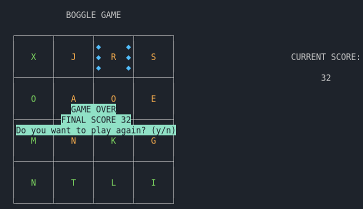

# Boggle game in C

Implementation of th Boggle game in C using **ncurses** library.

## Some concepts used in the game:

- **Data structure**

---

- **Draw board and graphics with ncurses**

---

- **Color management in ncurses**

---

- **Pointers and dynamic memory allocation**

---

## Build/Run Instructions

You can simply build the code using a makefile by typing `make` command.

To run and test the code: `./bin/boggle`

Type `make clean` to clean the project directory.

## Game demo

